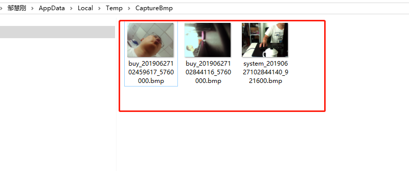

zshu

### ISampleGrabberCB接口

/*
定义一个类实现Sample Grabber 的回调接口IsampleGrabberCB；
调用RenderStream 依次把Still pin、Sample Grabber 和系统默认Renderer Filter 连接起来；
配置Sample Grabber 以捕获数据
*/

提供了 ISampleGrabberCB接口，ISampleGrabber接口的定义头文件 qedit.h。

### 保存图片

在win10下，win32/x64的各个版本测试通过，截图文件保存在%temp%\CaptureBmp\目录下面

	C:\Users\zouhu\AppData\Local\Temp\CaptureBmp

//具体到本设备：
//USB Camera有两个Pin
//Capture pin和Still pin
//Capture pin用于视频流预览
//Still pin用于响应抓拍（可以软触发和硬件触发）
//想要使用Still pin，必须先连接上Capture pin，才能正常使用Still pin

YUY2跟RGB是不一样的。
MJPG是压缩的一种编码格式，跟jpg压缩格式是不一样的。
如果你要拍照，只在在TransformFilter里抓图就行了。
要存储为BMP就直接按BMP文件的格式存储就行了，要是想存为JPG的就得用jpeblib库自己再实现压缩后再存储。
抓图参考例子：DXSDK\Samples\C++\DirectShow\Editing\StillCap

实现的效果图:

### 问题:

Q：

	无法打开包括文件: dxtrans.h

A：

	1.安装DirectShow SDK
	
	2.解压文件夹，编译DirectShow\Samples\C++\DirectShow\BaseClasses里的baseclasses.sln
	
	3.将对应的include加入自己的工程中
	
	若接着又出现    无法打开包括文件: dxtrans.h ：
	
	               在引用 qedit.h 头文件的时候，加上这么几句：
	
		#pragma include_alias( "dxtrans.h", "qedit.h" )
		#define __IDxtCompositor_INTERFACE_DEFINED__
		#define __IDxtAlphaSetter_INTERFACE_DEFINED__
		#define __IDxtJpeg_INTERFACE_DEFINED__
		#define __IDxtKey_INTERFACE_DEFINED__
		#include "qedit.h"

### 参考文档

[https://blog.csdn.net/longji/article/details/53455028](https://blog.csdn.net/longji/article/details/53455028)
[https://blog.csdn.net/wuxiaoyao12/article/details/7257891](https://blog.csdn.net/wuxiaoyao12/article/details/7257891)
[https://blog.csdn.net/jacken123456/article/details/80458772](https://blog.csdn.net/jacken123456/article/details/80458772)
[https://www.cnblogs.com/mlj318/p/3782534.html](https://www.cnblogs.com/mlj318/p/3782534.html)