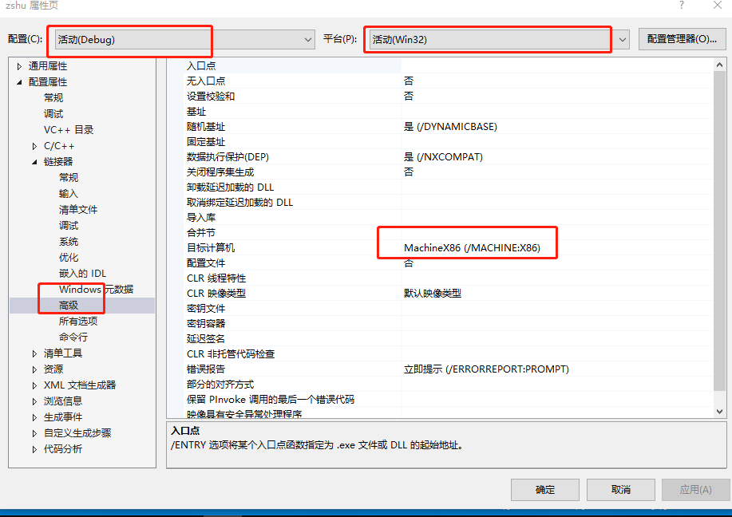
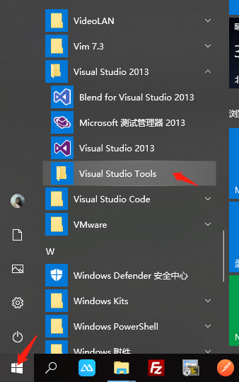
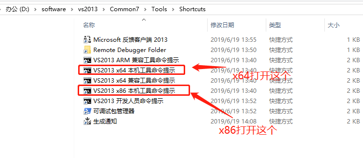
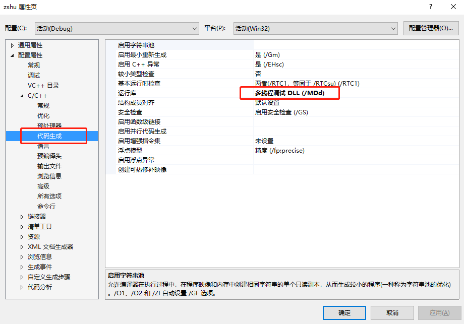
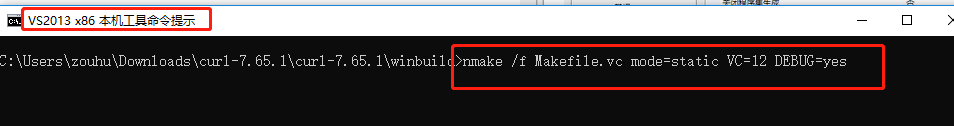
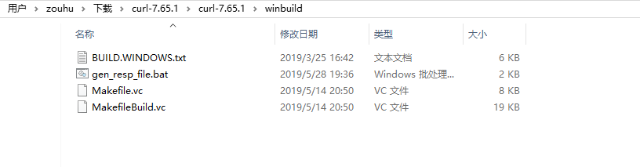
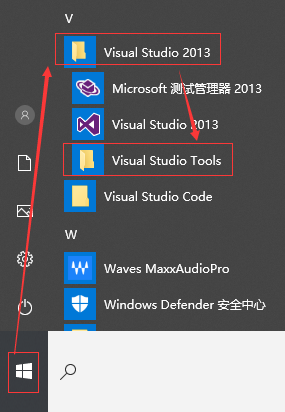
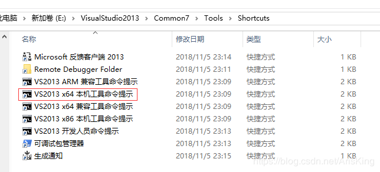

### 网络请求

### 哎呀妈，终于解决问题了

查看vs2013->链接器->高级

可以分析出，需要的libcurl的版本为：debug模式下的,win32 x86库。

然后:

查看到底需要的是什么模式的:

所以得出我需要的libcurl：

### 配置管理器有2种： win32和x64

libcurl下载地址：

	https://curl.haxx.se/download.html

我下载了最新版:

	curl-7.65.1

然后解压进入winbuild目录，因为是在windows下使用:

使用:

>VS生成代码的时候有一个运行库选项（项目属性 - 配置属性 - C/C++ - 代码生成 - 运行库）/MT和/MD（/MTd和/MDd是对应的debug版本）。编译时如果加了RTLIBCFG=static这个选项，就相当于编译了/MT版本的libcurl，否则是/MD版本的（默认）；如果加了DEBUG=yes，就是编译了Debug版本的，否则就是Release版本的（默认）

静态库，debug

	#nmake /f Makefile.vc mode=static VC=14 DEBUG=yes MACHINE=x86
	nmake /f Makefile.vc mode=static VC=12 MACHINE=x64 DEBUG=yes
	nmake /f Makefile.vc mode=static MACHINE=x64  DEBUG=yes

	vs2013配置了win32，说明是x86的
	nmake /f Makefile.vc mode=static MACHINE=x86  DEBUG=yes

静态库，release

	#nmake /f Makefile.vc mode=static VC=14  MACHINE=x86

	nmake /f Makefile.vc mode=static VC=12 MACHINE=x64 DEBUG=no
	#ENABLE_IDN=no

### 例子

	nmake /f Makefile.vc mode=static VC=12              //  相当于/MD
	nmake /f Makefile.vc mode=static VC=12 DEBUG=yes        //  相当于/MDd
	nmake /f Makefile.vc mode=static VC=12 RTLIBCFG=static               //  相当于/MT
	nmake /f Makefile.vc mode=static VC=12 RTLIBCFG=static  DEBUG=yes       //  相当于/MTd

使用:

	nmake /f Makefile.vc mode=static VC=12 MACHINE=x86 DEBUG=yes 

在build目录下生成库文件include lib bin

C:\Users\zouhu\Downloads\curl-7.65.1\curl-7.65.1\winbuild

### 配置

配置属性> C / C ++>常规>附加包含目录：添加

	C:\Users\zouhu\Downloads\curl-7.65.1\curl-7.65.1\builds\libcurl-vc-x86-debug-static-ipv6-sspi-winssl\include

配置属性>链接器>常规>其他库目录：添加

	C:\Users\zouhu\Downloads\curl-7.65.1\curl-7.65.1\builds\libcurl-vc-x86-debug-static-ipv6-sspi-winssl\lib

链接器->输入:

	将以下lib添加至工程！

	libcurl_a.lib;
	Ws2_32.lib;
	Wldap32.lib;
	winmm.lib;
	Crypt32.lib;
	Normaliz.lib;

debug下是:

	libcurl_a_debug.lib

c/c++->预处理器:

	使用了静态编译libcurl，所以需要将CURL_STATICLIB预编译添加至工程。

添加:

	CURL_STATICLIB

### nmake怎么使用

Q:'nmake' 不是内部或外部命令

A:
	“开始”菜单——>Visual Studio 2013——>Visual Studio Tools——>VS2013 开发人员命令提示。
	

Q:

	无法解析的外部符号 _curl_global_init

A:

	https://blog.csdn.net/yangchuangbao/article/details/80829966
	http://blog.chinaunix.net/uid-20698826-id-5765706.html
	https://blog.csdn.net/wcc27857285/article/details/86538804

Q:

	模块计算机类型“X86”与目标计算机类型“x64”冲突

A:

	原来在VS主页上设置完release和x64，在打开项目属性弹窗，属性页的设置是不会跟随主页上的设置变化的

	也就是属性页上的是分了Debug,Release,x86-x64 ,一共四种组合，需要我们手动设置，每种组合下都有自己的库目录，包含目录，附加链接库，预编译命令等等等等的一套设置
	--------------------- 
	作者：Bird鸟人 
	来源：CSDN 
	原文：https://blog.csdn.net/wcc27857285/article/details/86538804 
	版权声明：本文为博主原创文章，转载请附上博文链接！

Q:
	无法解析的外部符号 _curl_slist_append
a:
	链接器->输入->附加依赖项:
	libcurl_imp.lib

[https://blog.csdn.net/baidu_41327283/article/details/82715062](https://blog.csdn.net/baidu_41327283/article/details/82715062)

[https://blog.csdn.net/px41834/article/details/81627170](https://blog.csdn.net/px41834/article/details/81627170)

[https://www.cnblogs.com/jkcx/p/6406706.html](https://www.cnblogs.com/jkcx/p/6406706.html)

[https://blog.csdn.net/arisking/article/details/87654166](https://blog.csdn.net/arisking/article/details/87654166)

[https://www.cnblogs.com/comor/p/7305746.html](https://www.cnblogs.com/comor/p/7305746.html)

[https://blog.csdn.net/wcc27857285/article/details/86538804](https://blog.csdn.net/wcc27857285/article/details/86538804)

[https://blog.csdn.net/qing101hua/article/details/74748838](https://blog.csdn.net/qing101hua/article/details/74748838)

[https://www.cnblogs.com/comor/p/7305746.html](https://www.cnblogs.com/comor/p/7305746.html)

[https://www.cnblogs.com/comor/p/7305746.html](https://www.cnblogs.com/comor/p/7305746.html)

[https://blog.csdn.net/youyongyoumou/article/details/50541481](https://blog.csdn.net/youyongyoumou/article/details/50541481)